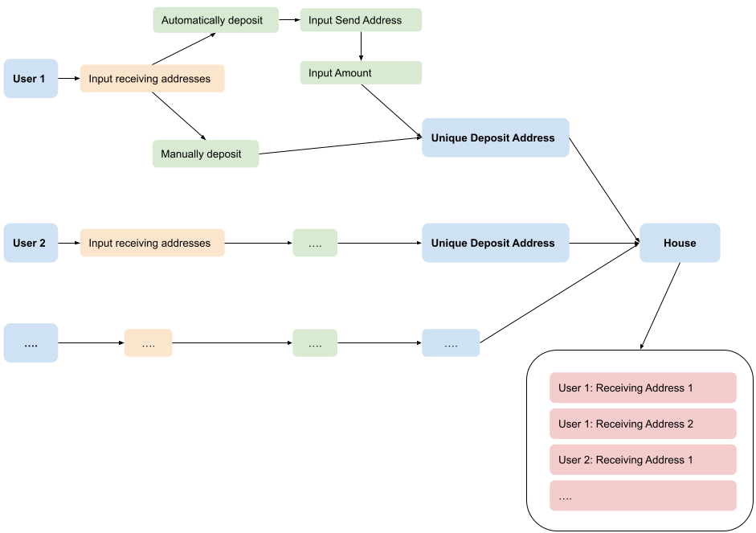

# Jobcoin mixer

Jobcoin Mixer written in Python

## Getting started

Make sure you're using python 3.8

Setup virtual env

```
virtualenv --python=python3 venv
source venv/bin/activate
```

Install requirements

```
pip install -r requirements.txt
```

Start the CLI

```
python cli.py
```

## Approach
The app is split into the following folders:
- Main CLI: `/cli.py`
- API Calls: `/jobcoin/config.py`
- Main Mixer: `/jobcoin/jobcoin.py`
- Other CLI prompts: `/jobcoin/prompts.py`

## How it works



This mixer waits for multiple users (default 2) to send in transactions in order to shuffle its balance and then 'unload' it accordingly. In a real life scenario one could also add a time limit of several days before the house continues to send out all payments over a range of time.

Once a user initiates the mixer they get to specify the amount of addresses they would like to send their balance to. Once that is done, they have the option to send any amount of coins to the deposit address themselves or do it directly via the cli, after which a unique deposit address gets created. The address is unique to every user as this will allow the House to not need to store any information pertaining the users send address, and instead only track the deposit address and the corresponding receiving addresses. 

If the user chooses to send the coins automatically via the cli, they will be prompted to enter their send address (equivalent to signing in with a wallet in real life) and the amount they would like to send. If they choose to manually send the jobcoins to the deposit address, the House account will observe any incoming transactions to the given deposit address for a given period of time (60 seconds by default) at specific time intervals (every 5 seconds by default). Once it tracks an incoming transaction, it knows that that's the amount of jobcoins that need to be transferred to the receiving addresses as specified by the user prior.

After the deposit has been made, the balance will be sent to the House account, which is where it gets mixed with all the other incoming deposits (2 by default). The house calculates a maximum amount it will send to every receiving address to make it more difficult to track what balance came from which originating address. 

    *Example:*
    - A sends 10 coins to the House, alongside 2 recipient addresses [C,D]
    - B sends 10 coins to the house, alongside 3 recipient addresses [E,F,G]

      then the house will proceed to:
      - send 3 coins to C
      - send 2 coins to C
      - send 3 coins to D
      - send 2 coins to D
      - send 3 coins to E
      - send 3 coins to F
      - send 3 coins to G
    
As soon as the house has received deposits from the specified number of users it proceeds to unload the splits to all the corresponding receiving addresses.


## Improvements going forward
Here are a few thoughts about my current mixer and how I could have improved it.

- First of all, it would be good to add tests for all functions (both unit and integration tests as many of my functions call on other functions).
- Some improvements to make it harder to track the transactions:
  - Shuffle the order in which the house pays out all payments.
  - Include further time delays during the house payout
  - Add a dynamic house fee within a range (e.g. between  0% to 5% fee per transaction), to add more randomness in the amounts being transferred
  - Randomize the splits instead of splitting everything equally (plus the remainder)
